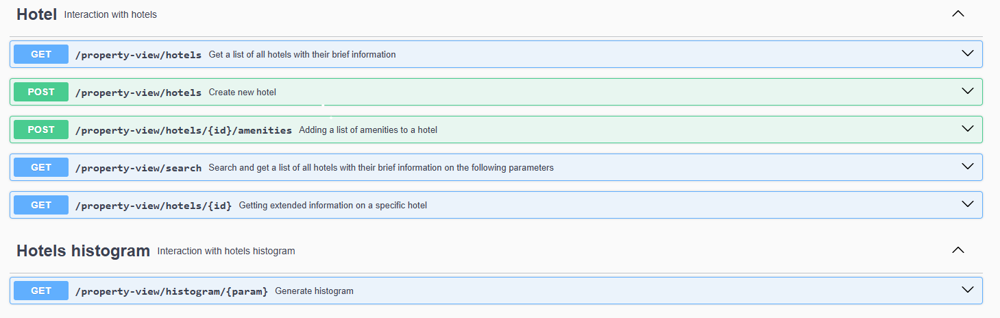
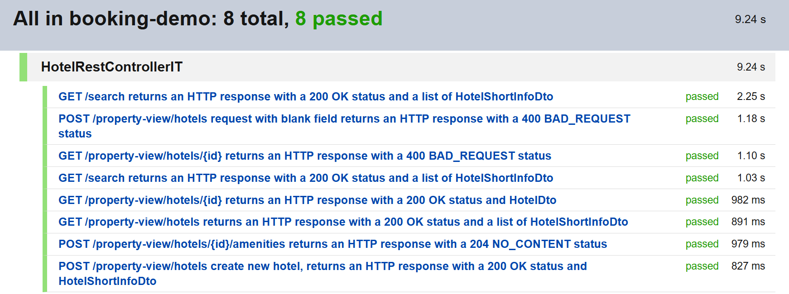

# Booking-demo RESTful Api

Test task from GP Solutions

## Technological stack
   - Java 17
   - Spring Boot
   - Spring Data Jpa
   - H2/MySQL (quick switch)
   - Liquibase
   - Swagger
   - JUnit, Mockito for integration test

## How to work with this Api

Download Api and go to directory `booking-demo`

```shell
    git clone https://github.com/mrPropper911/gp-solutions-task.git
    cd gp-solutions-task/booking-demo/
```
### Start Api with in-memory *H2*

```shell
    mvn spring-boot:run
```
### Start Api with *MySql*:

1. Create database

```shell
  create database booking_demo
```
2.1 Run application for test

```shell
  mvn spring-boot:run -Dspring.profiles.active=mysql-test
```
2.2 Run application for prod
```shell
  mvn spring-boot:run -Dspring.profiles.active=mysql-prod
```
The Api will start running at http://localhost:8092

The OpenApi is available at http://localhost:8092/swagger-ui/index.html

### Booking Demo Api Doc



### Test result


